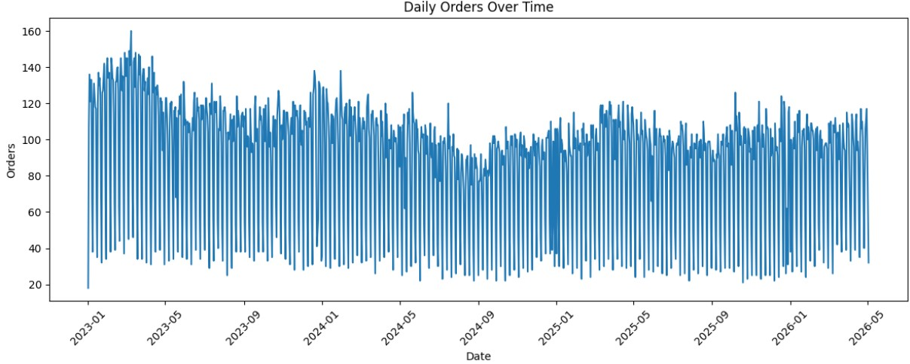
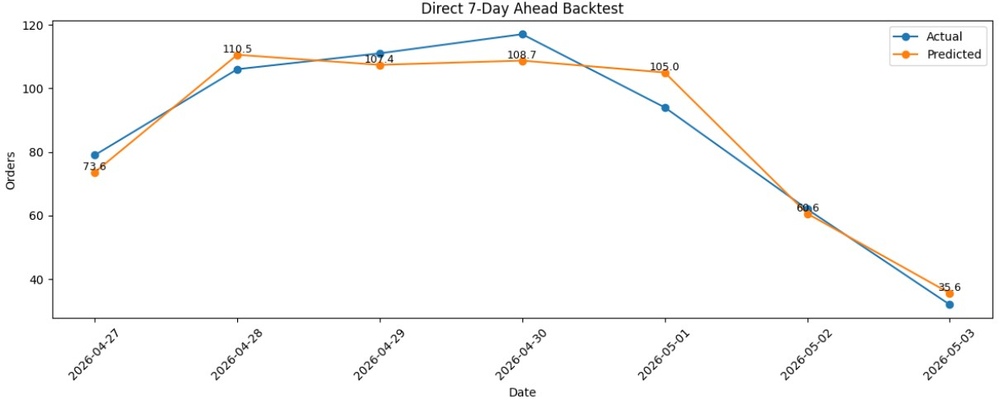
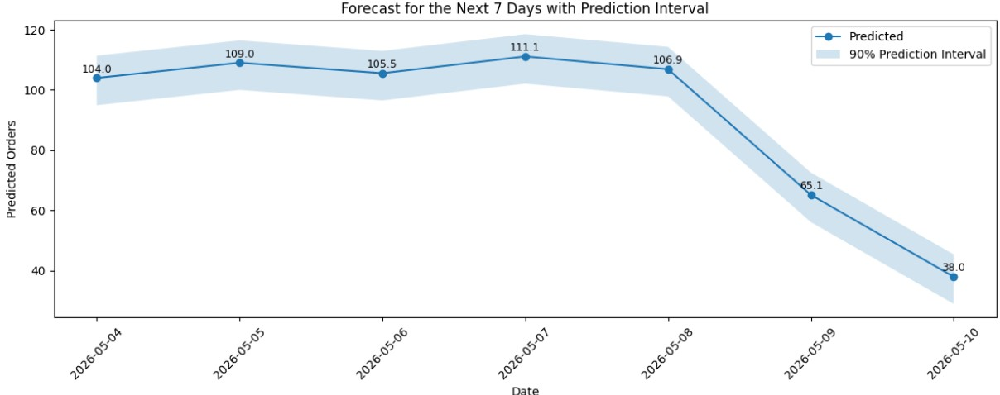
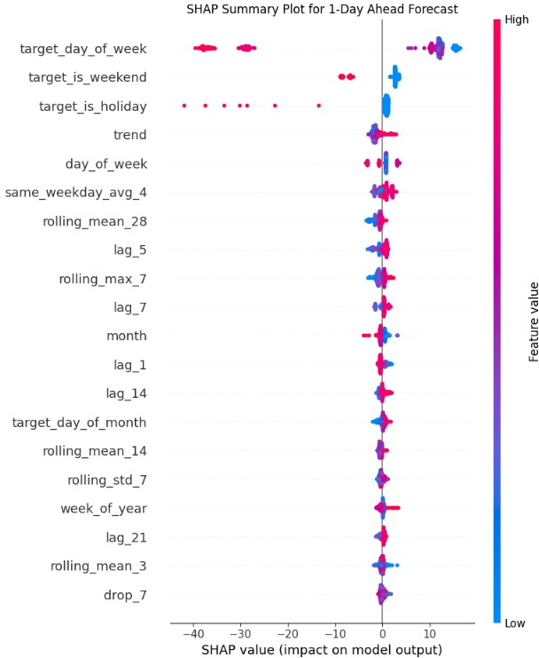
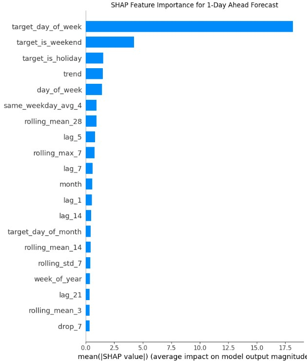

# Daily Orders Forecasting Using XGBoost

This project forecasts daily orders for the next 7 days using historical order data for selected customer-lane combinations within a specific transport category. The original dataset contains two columns: the date and the number of orders. Although the dataset is simple, additional calendar, lag, rolling, trend, holiday, and cyclical features were engineered to improve forecasting performance.

The objective is to build a short-term forecasting model that can help estimate expected order volume and support planning for staffing, inventory, and daily operations.

## Project Objective

The goal of this project is to predict the number of orders for the next 7 days using historical daily order data. The model is designed for short-term demand forecasting, where recent order behavior and calendar patterns are important.

## Dataset

The original dataset contains two main columns:

- `LoadingDate`: the date of the orders
- `orders`: the number of orders recorded on that date

The date column was converted to datetime format, sorted chronologically, and used as the time-series index. The order values were converted to numeric format.

## Methodology

The project follows these main steps:

1. Load and prepare the daily orders dataset
2. Explore order behavior over time
3. Engineer time-series and calendar-based features
4. Train XGBoost regression models for forecast horizons from 1 to 7 days ahead
5. Evaluate the model using a 7-day holdout backtest
6. Estimate prediction intervals using backtest residuals
7. Forecast orders for the next 7 days
8. Interpret the model using feature importance and SHAP values

## Feature Engineering

Although the original dataset contains only dates and order counts, several features were created to improve forecasting performance:

- Calendar features: day of week, week of year, month, year, and day of month
- Weekend, Sunday, holiday, and end-of-month indicators
- Cyclical date features using sine and cosine transformations
- Lag features from previous order values
- Rolling statistics such as rolling mean, standard deviation, minimum, and maximum
- Trend and momentum features based on recent order changes
- Future calendar features for each forecast horizon

## Model

The forecasting model used in this project is XGBoost Regressor. Separate models were trained for each forecast horizon from 1 day ahead to 7 days ahead.

## Backtesting

The model was evaluated using a 7-day holdout backtest. The last 7 days were excluded from training and then predicted using horizon-specific models. This simulates a realistic forecasting situation where the model predicts one full week ahead.

| Metric | Value |
|---|---:|
| MAE | 5.40 |
| MAPE | 6.66% |

The backtest results show that the model was able to follow the recent order pattern reasonably well.

## Prediction Intervals

Prediction intervals were estimated using the residuals from the backtest. The 5th and 95th percentiles of the backtest errors were added to the future predictions to create an approximate 90% prediction interval.

This gives a practical uncertainty range around the forecasted order values.

## Model Interpretation

Feature importance and SHAP values were used to interpret the model. The interpretation showed that calendar-related variables, especially the target day of week and weekend indicators, had a strong influence on the forecast. Historical order patterns such as lag and rolling features also contributed to the predictions.

## Visual Results

### Daily Orders Over Time

### 7-Day Backtest

### Forecast with Prediction Interval

### SHAP Summary Plot

### SHAP Feature Importance

## Repository Files

- `orders_forecasting_xgboost.ipynb`: main notebook containing the full workflow
- `requirements.txt`: required Python libraries
- `figures/`: saved visualizations used in the project
- `data_sample/`: optional sample data file

## Tools and Libraries

- Python
- Pandas
- NumPy
- Matplotlib
- XGBoost
- Scikit-learn
- holidays
- SHAP

## Limitations

The dataset contains only historical dates and order counts. Forecasting accuracy could be improved by adding more business-related variables, such as:

- promotions
- weather
- marketing campaigns
- stock availability
- pricing changes
- special events
- delivery disruptions
- holidays with special demand effects

## Conclusion

This project demonstrates how a short-term demand forecasting model can be built from a simple two-column dataset using feature engineering and XGBoost regression. The model includes backtesting, prediction intervals, and SHAP-based interpretation, making it both practical and explainable.

- Calendar features, such as day of week, week of year, month, year, and day of month.
- Weekend, Sunday, holiday, and end-of-month indicators.
- Cyclical date features using sine and cosine transformations.
- Lag features based on previous order values.
- Rolling statistics, such as rolling mean, standard deviation, minimum, and maximum.
- Trend and momentum features, such as differences between recent and older order values.
